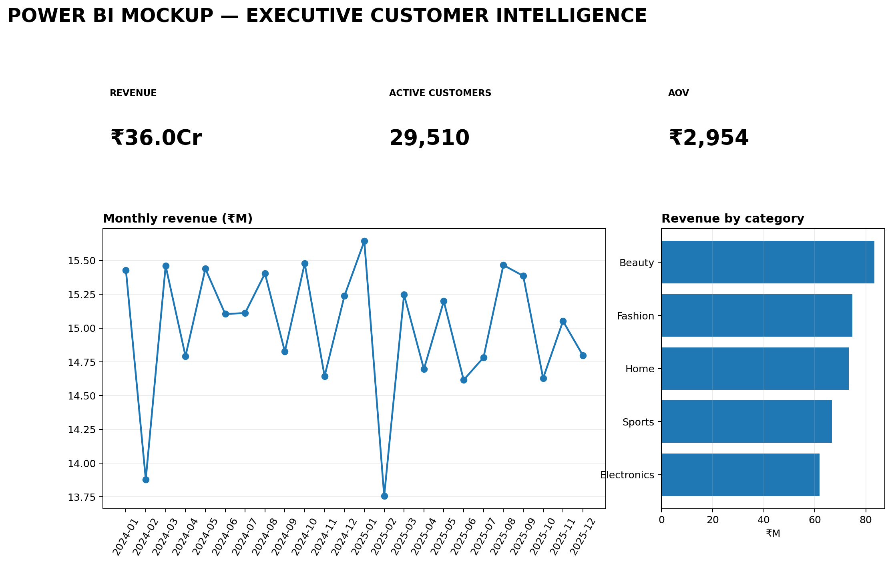
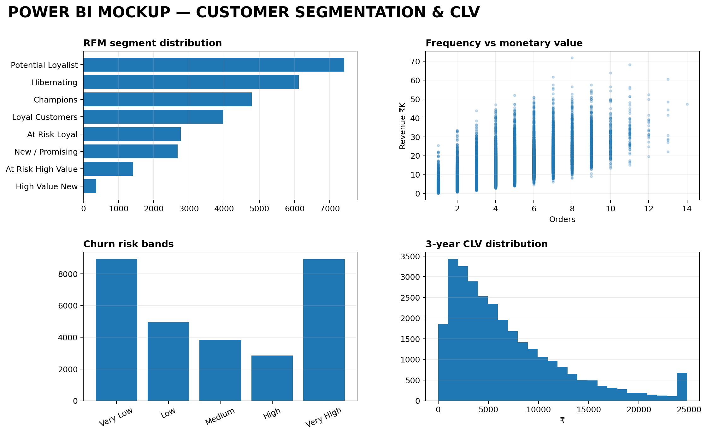
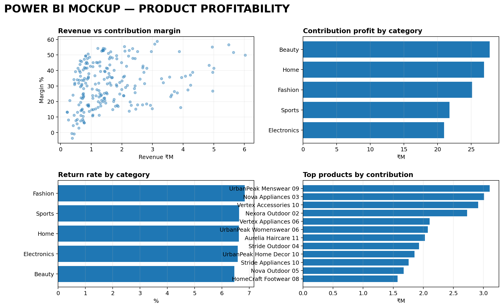
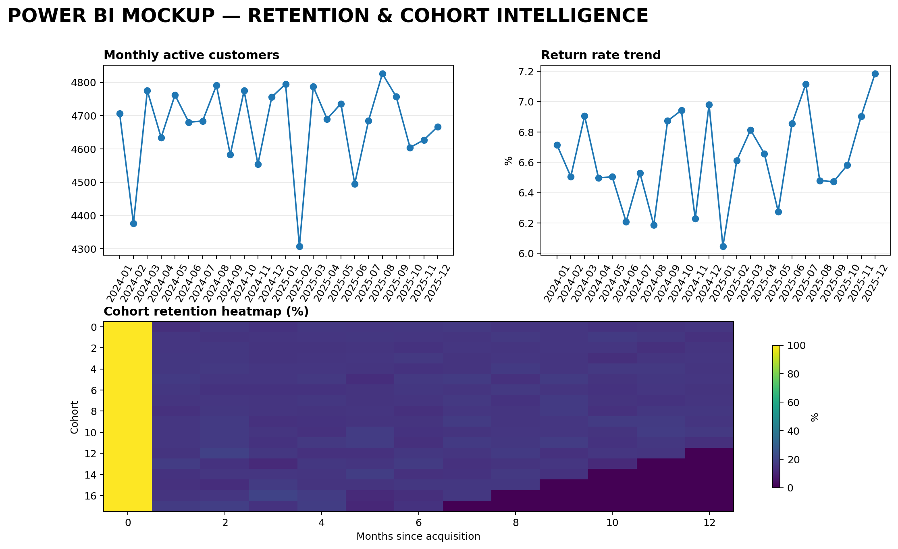

# Retail Customer Intelligence Platform

> **Advanced Data Analytics & Business Intelligence Portfolio Project**  
> **SQL + Python + Power BI | Customer 360 | RFM | CLV | Churn | Cohorts | Product Profitability**



## Executive Summary

This project simulates an end-to-end analytics environment for a multi-category omnichannel retailer.

Instead of stopping at sales reporting, the platform converts transactions into **customer, product, retention, geographic and acquisition intelligence** and then turns those insights into business actions.

### Core questions

- Who are the most valuable customers?
- Which high-value customers are at risk of churn?
- Which customer segments deserve retention investment?
- Which products generate the strongest contribution profit?
- Which products/categories have excessive returns?
- Which acquisition channels create high-quality customers?
- Which states generate the strongest customer economics?
- Are newer acquisition cohorts retaining better?

## Dataset Scale

| Asset | Volume |
|---|---:|
| Customers | 30,000 |
| Products | 220 |
| Orders | 125,000 |
| Transaction period | Jan 2024 – Dec 2025 |
| Product categories | 5 |
| Subcategories | 19 |
| States | 15 |
| Acquisition channels | 6 |

> **Data note:** all records are synthetic and generated with a fixed random seed for portfolio purposes. They are designed to resemble a realistic retail environment and are not real customer/company data.

## Architecture

```text
RAW TRANSACTIONS
      │
      ▼
DATA MODEL / SQL
      │
      ├── Customer 360
      ├── Product Profitability
      ├── Cohort Retention
      ├── Acquisition Economics
      └── Geographic Performance
      │
      ▼
PYTHON ANALYTICS
      │
      ├── RFM
      ├── CLV
      ├── Churn Risk
      ├── Segmentation
      └── Profitability Analysis
      │
      ▼
POWER BI
      │
      └── Executive Decision Dashboards
```

## Customer Intelligence



### RFM

Customers are scored on:

- **Recency** — how recently they purchased
- **Frequency** — how often they purchase
- **Monetary** — how much they spend

Segments include Champions, Loyal Customers, High Value New, At Risk Loyal, At Risk High Value, Hibernating, New/Promising and Potential Loyalist.

### CLV

A 3-year CLV estimate combines observed contribution economics with an assumed retention curve.

The objective is to prioritise customers based on **future economic value**, rather than historical revenue alone.

### Churn

A business scoring model uses recency, frequency, monetary value and return behaviour to create a churn-probability band.

The key action is:

> **Prioritise high-CLV customers with high churn probability for retention intervention.**

## Product Profitability



The product layer evaluates:

- Net revenue
- Gross profit
- Contribution profit
- Contribution margin
- Units
- Orders
- Return rate
- ABC class

This distinguishes products that are simply high-volume from products that actually create economic value.

## Retention & Cohorts



Cohort analysis follows customers from acquisition month and measures activity over subsequent months.

It can reveal whether growth is coming from:
- new customer acquisition,
- stronger repeat behaviour,
- or both.

## Geographic & Acquisition Intelligence

The model includes state-level revenue, customers, orders, contribution profit and revenue/customer.

Acquisition channels are evaluated on **economic quality**, not just customer volume.

## SQL Layer

The SQL implementation includes:

- PostgreSQL-compatible schema
- Primary/foreign keys
- Indexes
- CTEs
- Window functions
- NTILE-based RFM scoring
- Customer profitability
- Product profitability
- Cohort/retention logic
- Pareto revenue concentration
- Acquisition-channel economics
- Return-rate analysis
- Data-quality tests

## Python Layer

The notebook demonstrates:

- Data loading
- KPI computation
- RFM segmentation
- CLV modelling
- Product profitability
- Cohort construction
- Business interpretation

## Power BI Layer

### Dashboard pages

1. **Executive Customer Intelligence**
2. **Customer Segmentation & CLV**
3. **Retention & Cohorts**
4. **Product Profitability**
5. **Geographic & Acquisition Intelligence**
6. **Customer Risk Action Center**

The repository contains the DAX measure library and detailed Power BI build guide.

## Decision Framework

| Analytics finding | Business action |
|---|---|
| High CLV + high churn risk | Targeted retention |
| High revenue + weak contribution | Repricing / discount optimisation |
| High contribution + low volume | Cross-sell / merchandising |
| High returns | Product / fulfilment investigation |
| Strong channel + high customer value | Increase investment |
| High acquisition + low value | Optimise or reduce spend |
| Weak cohort retention | Improve onboarding / CRM |

## Repository

```text
retail-customer-intelligence-platform/
├── data/
│   ├── raw/
│   ├── analytics/
│   └── processed/
├── python/
│   └── retail_customer_intelligence.ipynb
├── sql/
│   ├── 01_schema.sql
│   ├── 02_advanced_analysis.sql
│   └── 03_data_quality.sql
├── powerbi/
│   ├── POWER_BI_GUIDE.md
│   └── DAX_MEASURES.md
├── powerbi_illustrations/
├── docs/
└── README.md
```

## Skills Demonstrated

**Business Intelligence:** KPI design, segmentation, retention, profitability, channel economics

**SQL:** data modelling, joins, CTEs, window functions, analytical SQL, QA

**Python:** pandas, NumPy, feature engineering, RFM, CLV, churn scoring, cohort analytics

**Power BI:** star schema, DAX, executive dashboards, drill-down analysis, customer risk views

## Portfolio Positioning

This project demonstrates the full path:

**Raw Data → SQL Model → Customer 360 → RFM → CLV → Churn → Cohorts → Product Profitability → Power BI → Business Action**

The emphasis is on moving from **data to decisions**, not simply producing charts.

---

